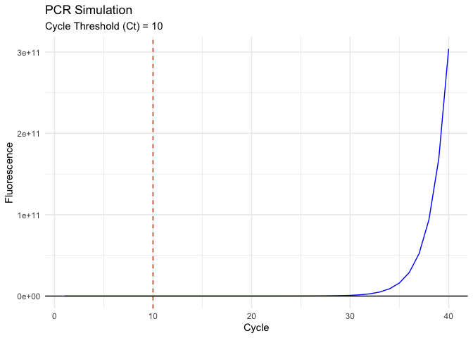
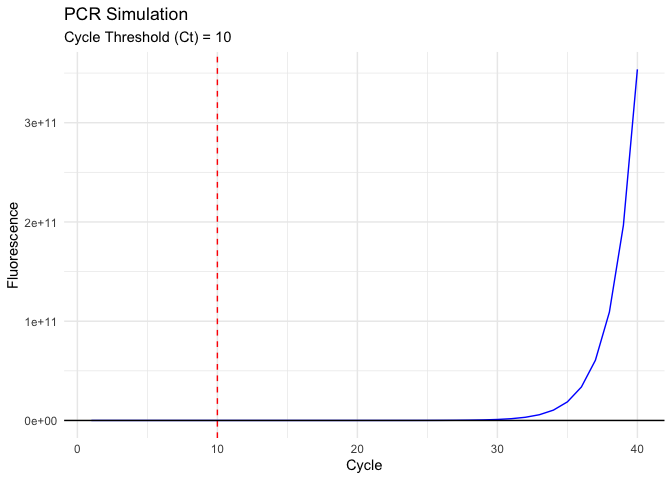

PCRSimPlot
================

<!-- README.md is generated from README.Rmd. Please edit that file -->

# PCRSimPlot

<figure>

<figcaption aria-hidden="true">PCRSimPLOT Logo</figcaption>
</figure>

<!-- badges: start -->
<!-- badges: end -->

PCRSimPlot is an R package for simulating and plotting PCR (Polymerase
Chain Reaction) data. The package includes functions for generating PCR
data based on specified parameters and visualizing the results.

## Installation

You can install the development version of PCRSimPlot like so:

``` r
You can install the development version of **PCRSimulation** from GitHub using the `devtools` package:

```r
# Install devtools if you haven't already
# install.packages("devtools")

# Install PCRSimPlot
devtools::install_github("AttaLowe/PCRSimPlot")

# Functions
`simulate_pcr()`
Simulates PCR data based on initial DNA concentration, amplification efficiency, and a fluorescence threshold.

# Usage
```r
simulate_pcr(N0, E, threshold = 10000)

```r
Arguments:

N0: Initial DNA concentration (numeric). For example, 10.
E: Amplification efficiency (numeric, between 1 and 2). For example, 1.8.
threshold: Fluorescence threshold for detecting the PCR signal (numeric, default is 10000).
Returns:

A list with two components:

pcr_data: A data frame containing the simulated PCR data with columns Cycle, DNA, and Fluorescence.
Ct: The cycle threshold (Ct) value at which the fluorescence exceeds the threshold.
```

## Example

This is a basic example which shows you how to solve a common problem:

``` r
library(PCRSimPlot)
result <- simulate_pcr(N0 = 10, E = 1.8)
print(result$pcr_data)
#>    Cycle          DNA Fluorescence
#> 1      1 1.000000e+01 1.025858e+03
#> 2      2 3.240000e+01 1.074638e+03
#> 3      3 5.832000e+01 1.131084e+03
#> 4      4 1.049760e+02 1.232687e+03
#> 5      5 1.889568e+02 1.415572e+03
#> 6      6 3.401222e+02 1.744765e+03
#> 7      7 6.122200e+02 2.337313e+03
#> 8      8 1.101996e+03 3.403898e+03
#> 9      9 1.983593e+03 5.323752e+03
#> 10    10 3.570467e+03 8.779489e+03
#> 11    11 6.426841e+03 1.499982e+04
#> 12    12 1.156831e+04 2.619640e+04
#> 13    13 2.082296e+04 4.635026e+04
#> 14    14 3.748134e+04 8.262721e+04
#> 15    15 6.746641e+04 1.479257e+05
#> 16    16 1.214395e+05 2.654630e+05
#> 17    17 2.185912e+05 4.770301e+05
#> 18    18 3.934641e+05 8.578510e+05
#> 19    19 7.082353e+05 1.543329e+06
#> 20    20 1.274824e+06 2.777188e+06
#> 21    21 2.294683e+06 4.998135e+06
#> 22    22 4.130429e+06 8.995840e+06
#> 23    23 7.434771e+06 1.619171e+07
#> 24    24 1.338259e+07 2.914427e+07
#> 25    25 2.408866e+07 5.245889e+07
#> 26    26 4.335959e+07 9.442520e+07
#> 27    27 7.804726e+07 1.699645e+08
#> 28    28 1.404851e+08 3.059354e+08
#> 29    29 2.528731e+08 5.506829e+08
#> 30    30 4.551716e+08 9.912284e+08
#> 31    31 8.193089e+08 1.784210e+09
#> 32    32 1.474756e+09 3.211578e+09
#> 33    33 2.654561e+09 5.780839e+09
#> 34    34 4.778209e+09 1.040551e+10
#> 35    35 8.600777e+09 1.872992e+10
#> 36    36 1.548140e+10 3.371385e+10
#> 37    37 2.786652e+10 6.068493e+10
#> 38    38 5.015973e+10 1.092329e+11
#> 39    39 9.028751e+10 1.966192e+11
#> 40    40 1.625175e+11 3.539145e+11
print(result$Ct)
#> [1] 10
```

    `plot_pcr()`
    Plots the simulated PCR data, showing fluorescence over cycles and the cycle threshold (Ct).
    # Usage
    ```r
    plot_pcr(pcr_data, Ct)
    ```r
    Arguments:

    pcr_data: A data frame containing the PCR data (typically from simulate_pcr()).
    Ct: The cycle threshold (Ct) value.
    Returns:

    A ggplot object visualizing the PCR data with a line plot of fluorescence over cycles, including a vertical line indicating the Ct valu

## Example

This is a basic example which shows you how to solve a common problem:

``` r

result <- simulate_pcr(N0 = 10, E = 1.8)
plot <- plot_pcr(result$pcr_data, result$Ct)
print(plot)
```



    # Example
    Here’s a full example of how to use the package:

    ```r
    # Load the package
    library(PCRSimPlot)

    # Simulate PCR data
    result <- simulate_pcr(N0 = 10, E = 1.8)

    # Print the simulated data and Ct value
    print(result$pcr_data)
    #>    Cycle          DNA Fluorescence
    #> 1      1 1.000000e+01 1.044057e+03
    #> 2      2 3.240000e+01 1.144980e+03
    #> 3      3 5.832000e+01 1.261762e+03
    #> 4      4 1.049760e+02 1.471970e+03
    #> 5      5 1.889568e+02 1.850345e+03
    #> 6      6 3.401222e+02 2.531419e+03
    #> 7      7 6.122200e+02 3.757352e+03
    #> 8      8 1.101996e+03 5.964031e+03
    #> 9      9 1.983593e+03 9.936054e+03
    #> 10    10 3.570467e+03 1.708570e+04
    #> 11    11 6.426841e+03 2.995505e+04
    #> 12    12 1.156831e+04 5.311989e+04
    #> 13    13 2.082296e+04 9.481660e+04
    #> 14    14 3.748134e+04 1.698707e+05
    #> 15    15 6.746641e+04 3.049680e+05
    #> 16    16 1.214395e+05 5.481432e+05
    #> 17    17 2.185912e+05 9.858586e+05
    #> 18    18 3.934641e+05 1.773746e+06
    #> 19    19 7.082353e+05 3.191944e+06
    #> 20    20 1.274824e+06 5.744700e+06
    #> 21    21 2.294683e+06 1.033966e+07
    #> 22    22 4.130429e+06 1.861059e+07
    #> 23    23 7.434771e+06 3.349826e+07
    #> 24    24 1.338259e+07 6.029608e+07
    #> 25    25 2.408866e+07 1.085321e+08
    #> 26    26 4.335959e+07 1.953571e+08
    #> 27    27 7.804726e+07 3.516419e+08
    #> 28    28 1.404851e+08 6.329546e+08
    #> 29    29 2.528731e+08 1.139317e+09
    #> 30    30 4.551716e+08 2.050771e+09
    #> 31    31 8.193089e+08 3.691386e+09
    #> 32    32 1.474756e+09 6.644495e+09
    #> 33    33 2.654561e+09 1.196009e+10
    #> 34    34 4.778209e+09 2.152816e+10
    #> 35    35 8.600777e+09 3.875069e+10
    #> 36    36 1.548140e+10 6.975124e+10
    #> 37    37 2.786652e+10 1.255522e+11
    #> 38    38 5.015973e+10 2.259940e+11
    #> 39    39 9.028751e+10 4.067892e+11
    #> 40    40 1.625175e+11 7.322206e+11
    print(result$Ct)
    #> [1] 9

    # Plot the results
    plot <- plot_pcr(result$pcr_data, result$Ct)
    print(plot)


