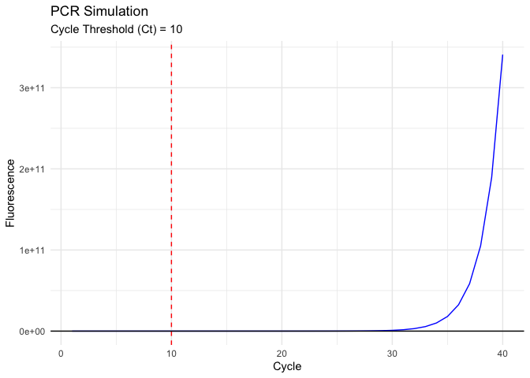

PCRSimPlot
================

<!-- README.md is generated from README.Rmd. Please edit that file -->

# PCRSimPlot

<!-- badges: start -->
<!-- badges: end -->

PCRSimPlot is an R package for simulating and plotting PCR (Polymerase
Chain Reaction) data. The package includes functions for generating PCR
data based on specified parameters and visualizing the results.

## Installation

You can install the development version of PCRSimPlot like so:

``` r
You can install the development version of **PCRSimulation** from GitHub using the `devtools` package:

```r
# Install devtools if you haven't already
# install.packages("devtools")

# Install PCRSimPlot
devtools::install_github("AttaLowe/PCRSimPlot")

# Functions
`simulate_pcr()`
Simulates PCR data based on initial DNA concentration, amplification efficiency, and a fluorescence threshold.

# Usage
```r
simulate_pcr(N0, E, threshold = 10000)

```r
Arguments:

N0: Initial DNA concentration (numeric). For example, 10.
E: Amplification efficiency (numeric, between 1 and 2). For example, 1.8.
threshold: Fluorescence threshold for detecting the PCR signal (numeric, default is 10000).
Returns:

A list with two components:

pcr_data: A data frame containing the simulated PCR data with columns Cycle, DNA, and Fluorescence.
Ct: The cycle threshold (Ct) value at which the fluorescence exceeds the threshold.
```

## Example

This is a basic example which shows you how to solve a common problem:

``` r
library(PCRSimPlot)
result <- simulate_pcr(N0 = 10, E = 1.8)
print(result$pcr_data)
#>    Cycle          DNA Fluorescence
#> 1      1 1.000000e+01 1.031745e+03
#> 2      2 3.240000e+01 1.101423e+03
#> 3      3 5.832000e+01 1.182052e+03
#> 4      4 1.049760e+02 1.327182e+03
#> 5      5 1.889568e+02 1.588418e+03
#> 6      6 3.401222e+02 2.058642e+03
#> 7      7 6.122200e+02 2.905045e+03
#> 8      8 1.101996e+03 4.428570e+03
#> 9      9 1.983593e+03 7.170916e+03
#> 10    10 3.570467e+03 1.210714e+04
#> 11    11 6.426841e+03 2.099234e+04
#> 12    12 1.156831e+04 3.698570e+04
#> 13    13 2.082296e+04 6.577374e+04
#> 14    14 3.748134e+04 1.175922e+05
#> 15    15 6.746641e+04 2.108655e+05
#> 16    16 1.214395e+05 3.787574e+05
#> 17    17 2.185912e+05 6.809628e+05
#> 18    18 3.934641e+05 1.224932e+06
#> 19    19 7.082353e+05 2.204078e+06
#> 20    20 1.274824e+06 3.966540e+06
#> 21    21 2.294683e+06 7.138971e+06
#> 22    22 4.130429e+06 1.284935e+07
#> 23    23 7.434771e+06 2.312803e+07
#> 24    24 1.338259e+07 4.162965e+07
#> 25    25 2.408866e+07 7.493256e+07
#> 26    26 4.335959e+07 1.348778e+08
#> 27    27 7.804726e+07 2.427793e+08
#> 28    28 1.404851e+08 4.370019e+08
#> 29    29 2.528731e+08 7.866025e+08
#> 30    30 4.551716e+08 1.415884e+09
#> 31    31 8.193089e+08 2.548590e+09
#> 32    32 1.474756e+09 4.587461e+09
#> 33    33 2.654561e+09 8.257429e+09
#> 34    34 4.778209e+09 1.486337e+10
#> 35    35 8.600777e+09 2.675407e+10
#> 36    36 1.548140e+10 4.815732e+10
#> 37    37 2.786652e+10 8.668318e+10
#> 38    38 5.015973e+10 1.560297e+11
#> 39    39 9.028751e+10 2.808535e+11
#> 40    40 1.625175e+11 5.055363e+11
print(result$Ct)
#> [1] 9
```

    `plot_pcr()`
    Plots the simulated PCR data, showing fluorescence over cycles and the cycle threshold (Ct).
    # Usage
    ```r
    plot_pcr(pcr_data, Ct)
    ```r
    Arguments:

    pcr_data: A data frame containing the PCR data (typically from simulate_pcr()).
    Ct: The cycle threshold (Ct) value.
    Returns:

    A ggplot object visualizing the PCR data with a line plot of fluorescence over cycles, including a vertical line indicating the Ct valu

## Example

This is a basic example which shows you how to solve a common problem:

``` r

result <- simulate_pcr(N0 = 10, E = 1.8)
plot <- plot_pcr(result$pcr_data, result$Ct)
print(plot)
```



    # Example
    Here’s a full example of how to use the package:

    ```r
    # Load the package
    library(PCRSimPlot)

    # Simulate PCR data
    result <- simulate_pcr(N0 = 10, E = 1.8)

    # Print the simulated data and Ct value
    print(result$pcr_data)
    #>    Cycle          DNA Fluorescence
    #> 1      1 1.000000e+01 1.031556e+03
    #> 2      2 3.240000e+01 1.080315e+03
    #> 3      3 5.832000e+01 1.136735e+03
    #> 4      4 1.049760e+02 1.238291e+03
    #> 5      5 1.889568e+02 1.421093e+03
    #> 6      6 3.401222e+02 1.750135e+03
    #> 7      7 6.122200e+02 2.342412e+03
    #> 8      8 1.101996e+03 3.408510e+03
    #> 9      9 1.983593e+03 5.327487e+03
    #> 10    10 3.570467e+03 8.781645e+03
    #> 11    11 6.426841e+03 1.499913e+04
    #> 12    12 1.156831e+04 2.619060e+04
    #> 13    13 2.082296e+04 4.633525e+04
    #> 14    14 3.748134e+04 8.259562e+04
    #> 15    15 6.746641e+04 1.478643e+05
    #> 16    16 1.214395e+05 2.653479e+05
    #> 17    17 2.185912e+05 4.768184e+05
    #> 18    18 3.934641e+05 8.574652e+05
    #> 19    19 7.082353e+05 1.542630e+06
    #> 20    20 1.274824e+06 2.775925e+06
    #> 21    21 2.294683e+06 4.995858e+06
    #> 22    22 4.130429e+06 8.991737e+06
    #> 23    23 7.434771e+06 1.618432e+07
    #> 24    24 1.338259e+07 2.913096e+07
    #> 25    25 2.408866e+07 5.243493e+07
    #> 26    26 4.335959e+07 9.438206e+07
    #> 27    27 7.804726e+07 1.698869e+08
    #> 28    28 1.404851e+08 3.057956e+08
    #> 29    29 2.528731e+08 5.504313e+08
    #> 30    30 4.551716e+08 9.907756e+08
    #> 31    31 8.193089e+08 1.783395e+09
    #> 32    32 1.474756e+09 3.210111e+09
    #> 33    33 2.654561e+09 5.778198e+09
    #> 34    34 4.778209e+09 1.040076e+10
    #> 35    35 8.600777e+09 1.872136e+10
    #> 36    36 1.548140e+10 3.369845e+10
    #> 37    37 2.786652e+10 6.065720e+10
    #> 38    38 5.015973e+10 1.091830e+11
    #> 39    39 9.028751e+10 1.965293e+11
    #> 40    40 1.625175e+11 3.537528e+11
    print(result$Ct)
    #> [1] 10

    # Plot the results
    plot <- plot_pcr(result$pcr_data, result$Ct)
    print(plot)


